Drools Demo
===

Course planner application for demonstrating Drools use-cases and configuration. Current configuration assumes a central
rules repository (Drools Workbench) what will contain the rules and can be configured at runtime.

## `drools-demo-facts`
Contains classes that are needed in authoring rules. This artifact is imported into the workbench to be able to
reference fact classes.

## `drools-demo-app`
The actual application for the course planner.


To Be able to use this sample, you need to have a running Drools Workbench on your system. The most compatible container for this is Wildfly. The setup guides for these are found below.

### Setup Wildfly
Download [Wildfly 8](http://download.jboss.org/wildfly/8.2.1.Final/wildfly-8.2.1.Final.zip) (you could also use any version of Wildfly above 8).

1.  Extract to desired location. For the purposes of this article, `${WILDFLY_HOME}` will refer to this path.
2.  Go to `${WILDFLY_HOME}/bin`
3.  Execute `add-user.sh`, select "a) Management User", enter your desired admin username and password then type yes to all questions. When asked to input groups, just leave it blank.
4.  Execute `add-user.sh` again, select "b) Application User", enter your desired Drools Workbench admin user, same as before but when asked for groups, type in "analyst,admin"
5.  Run wildfly by running `standalone.sh`

### Setup Drools Workbench
Download the [Drools Workbench 6.3.0.Final](http://download.jboss.org/drools/release/6.3.0.Final/kie-drools-wb-6.3.0.Final-wildfly8.war).
This version is chosen to match the version of the project dependency.

1.  Go to [Wildfly Manager](http://localhost:9990/console/App.html) and login using your admin account.
2.  Go to Deployments select "Add". Then upload the Drools Workbench WAR file. 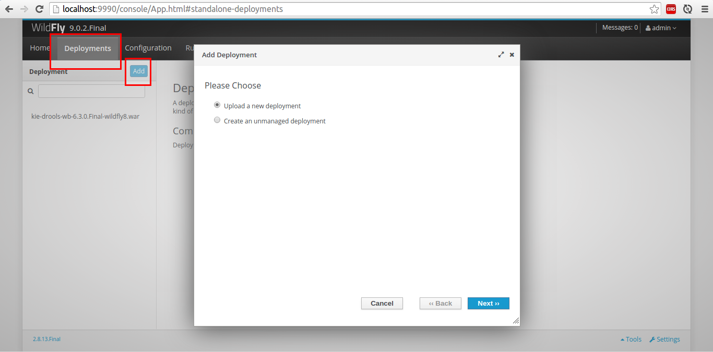
3.  When the upload is done, the drools application will be in http://localhost:8080/kie-drools-wb-6.3.0.Final-wildfly8
4.  Log-in using the Drools Admin user you've created.

### Setup a Drools Project
Before going any further, make sure you install the `drools-demo-facts` artifact. 

In the `drools-demo-facts` folder:

```
$ mvn clean install
```

This will create an artifact in your local maven repository (usually located at `~/.m2/repository/com/rmpader/course-suggestion/1.0/course-suggestion-1.0.jar`).
Take note of this location because you will be uploading this particular JAR file in the workbench later. Also, make sure 
to remember that each time you change the facts artifact dependency in your project, it is advisable to also upload the new artifact in the workbench.
Lastly, as much as possible, only upload RELEASED versions of your facts artifact. Using SNAPSHOTS are dangerous because 
those artifacts could change without notice.

Now setup a Drools Project in the Workbench.

*  Log-in as your Drools Administration User in the workbench

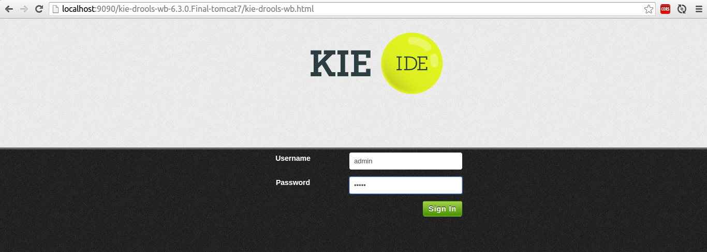

*  Go to the artifact repository and upload the facts artifact JAR file generated earlier:

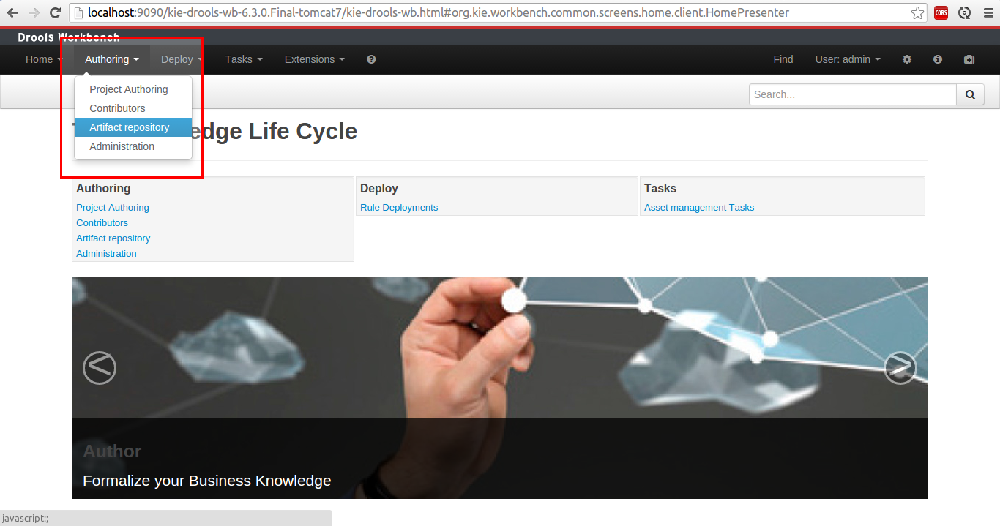

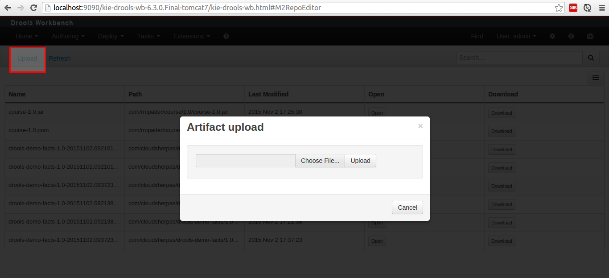

*  In the **Authoring > Administration** page:

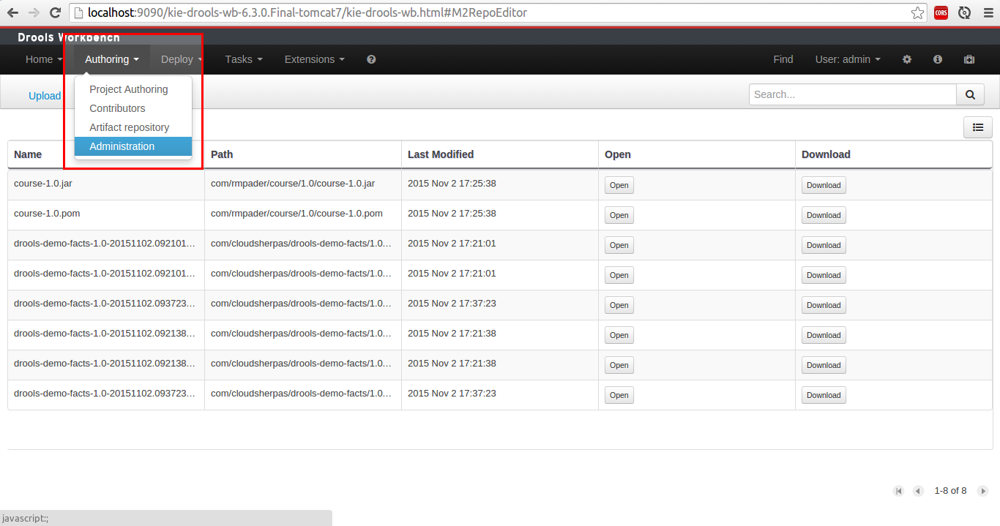
    
*  Create a new organizational unit:
    
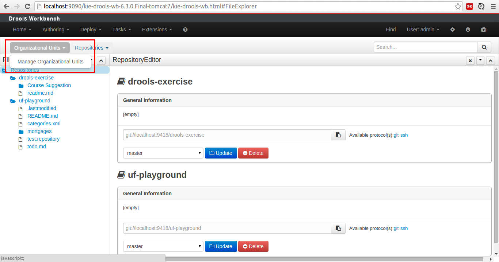
    
and a repository for the new Organizational Unit:

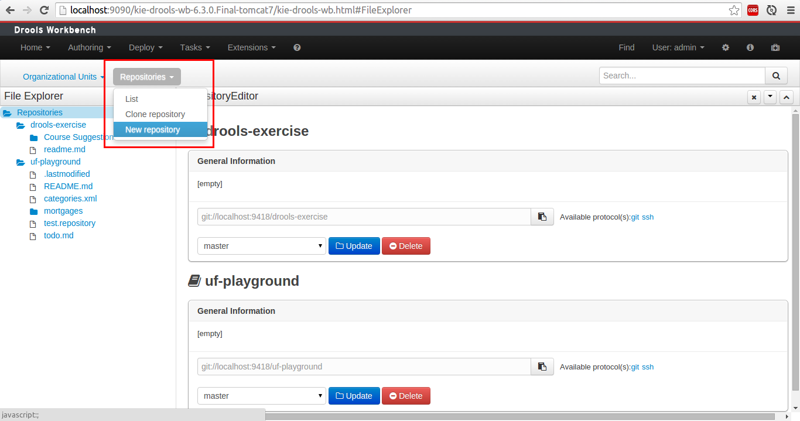

*  Go to Project Authoring:

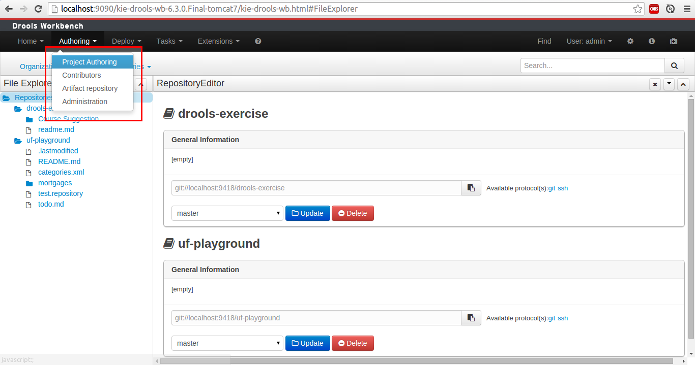

*  Select the correct Organizational unit and the correct repository:

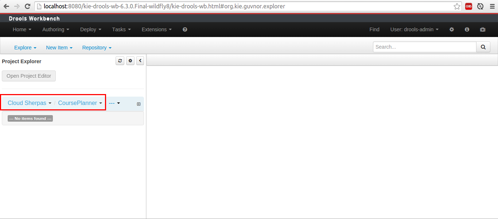

*  Create a project:

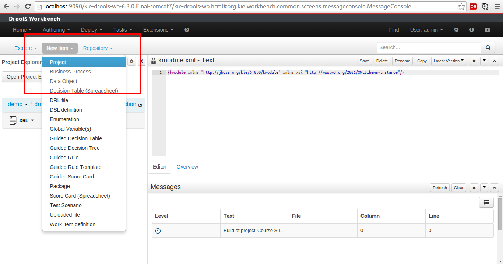

*  Create a new Drool file (New Item > DRL file) with the contents of `course_suggestion.drl`. The package declaration must stay as what is generated by the workbench:

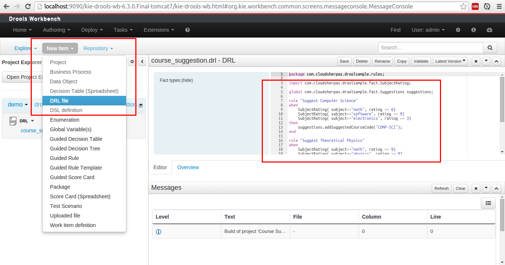

Make sure to click on **Validate** before saving the file you will notice that some errors will pop-up. This is because we haven't added the dependencies for the facts yet.

*  Open the Project Editor and go to the dependencies section:

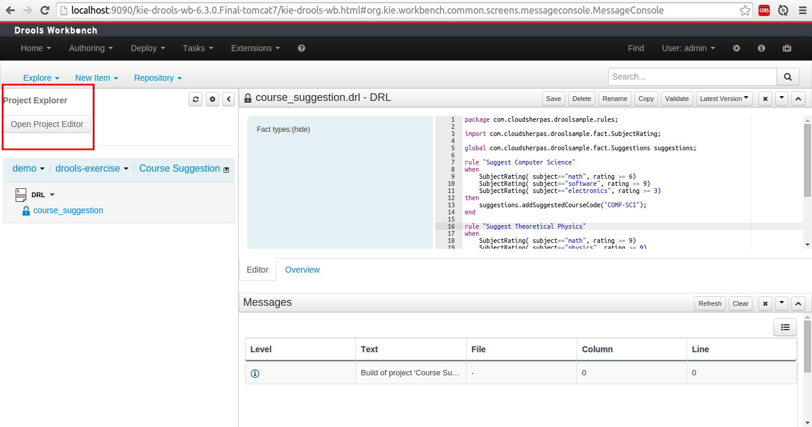

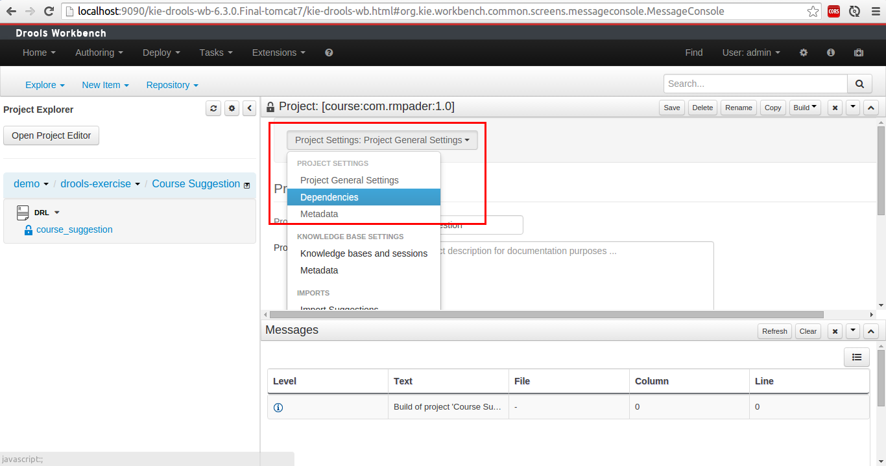

*  Click "Add from repository" and select the uploaded JAR file from the first step. Make sure to click the save button near the search bar afterwards.

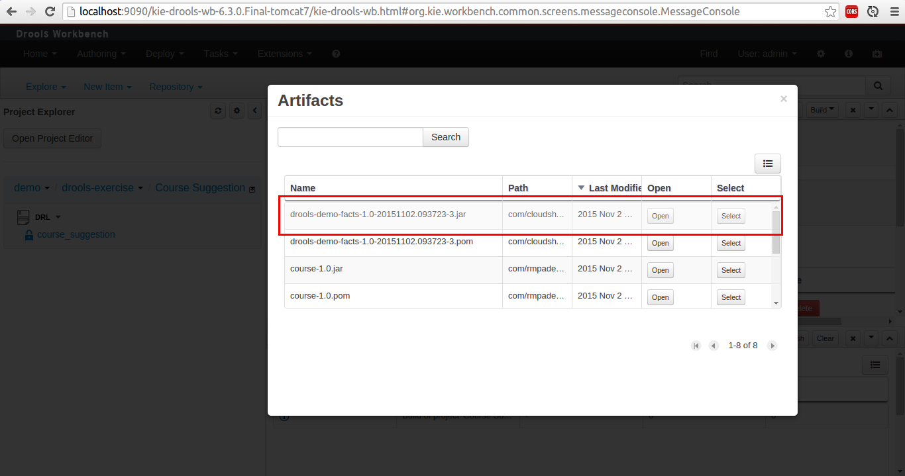

*  Go back to your DRL file and click on validate again. There should be no more error pertaining to unresolved classes.

*  Click "Build & Deploy" to rules and get the download link from the Artifact repository.

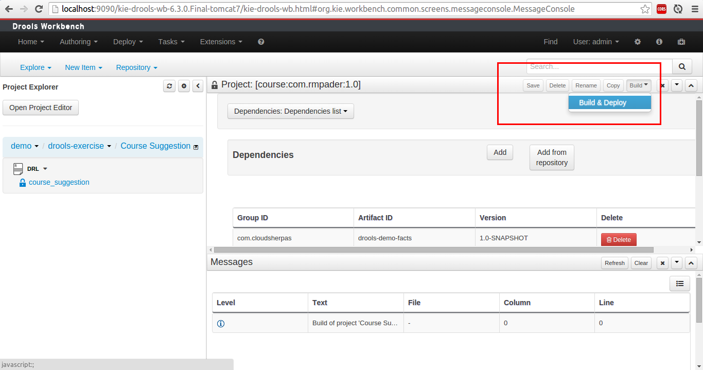

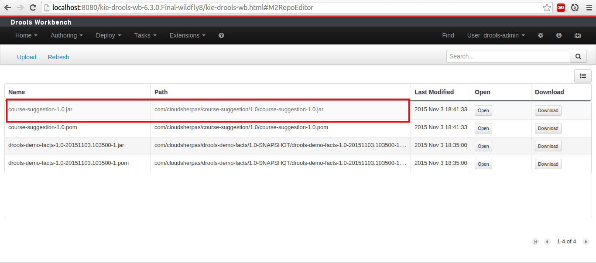

*  The artifact URL will be `{workbench URL} + /maven2/ + value of PATH`. In this case it will be http://localhost:8080/kie-drools-wb-6.3.0.Final-wildfly8/maven2/com/rmpader/course-suggestion/1.0/course-suggestion-1.0.jar

*  Find `RulesConfig.java` in `drools-demo-app` and change the URL to the download URL from the previous step

*  Update the release ID in `RulesConfig.java` to the correct information of your Drools Project

## How to run
In the `drools-demo-app` folder:
    
```
$ mvn spring-boot:run
```

    
## Testing
Use [Postman](https://chrome.google.com/webstore/detail/postman/fhbjgbiflinjbdggehcddcbncdddomop?hl=en) to interact with
the API.

Sample GET request:
    http://localhost:8081/course/suggest?math=7&software=10&electronics=5&arts=10&social_studies=7
